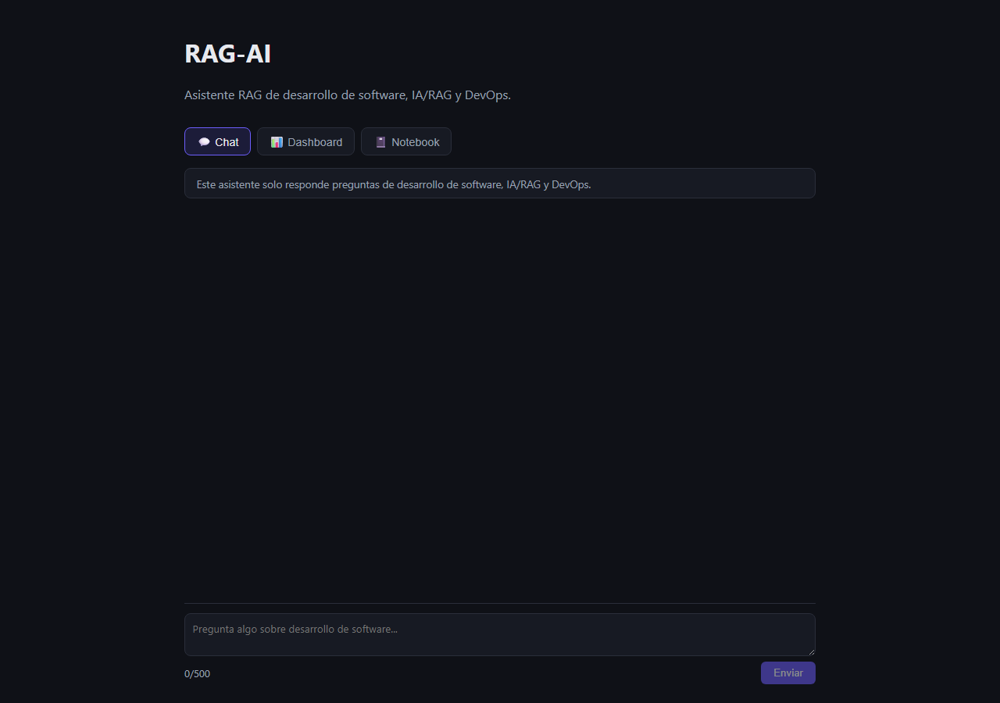
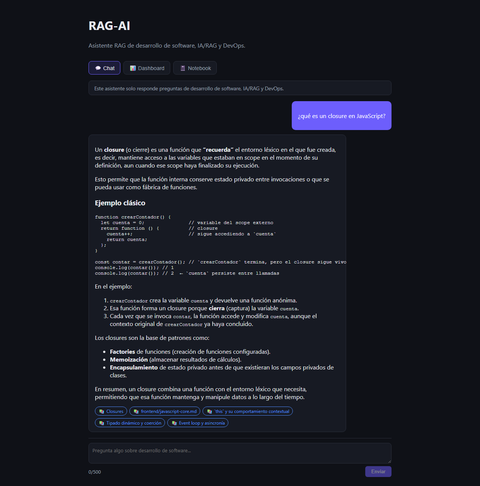
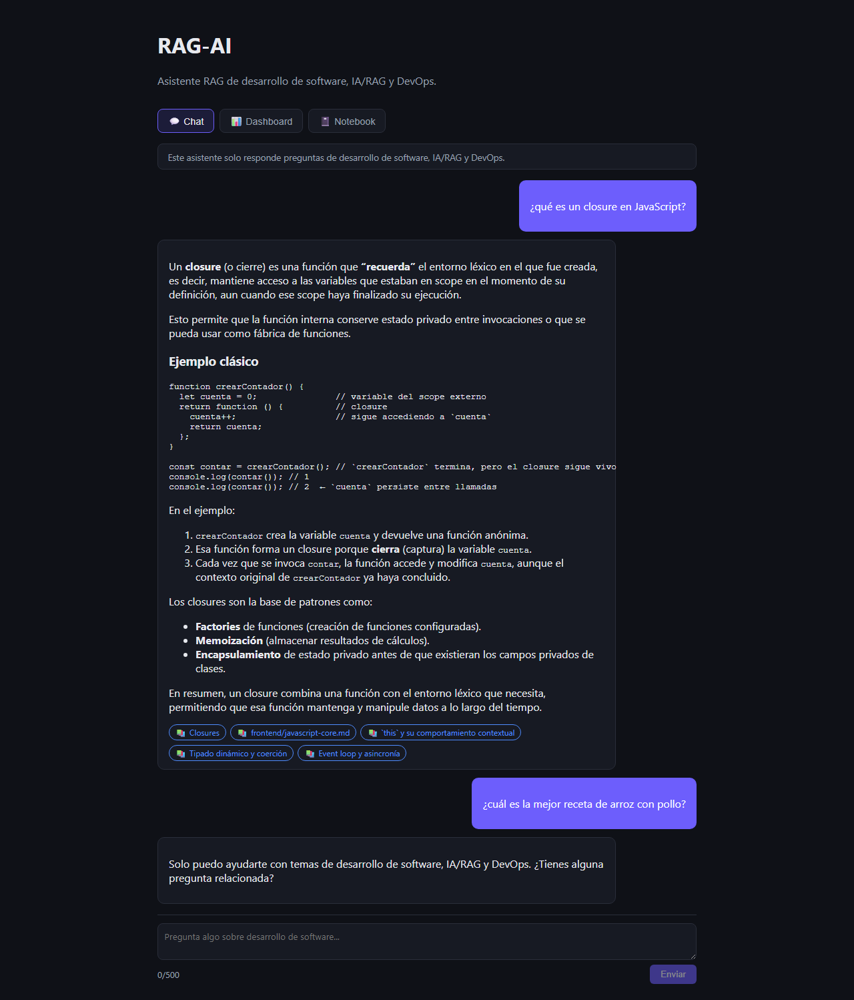
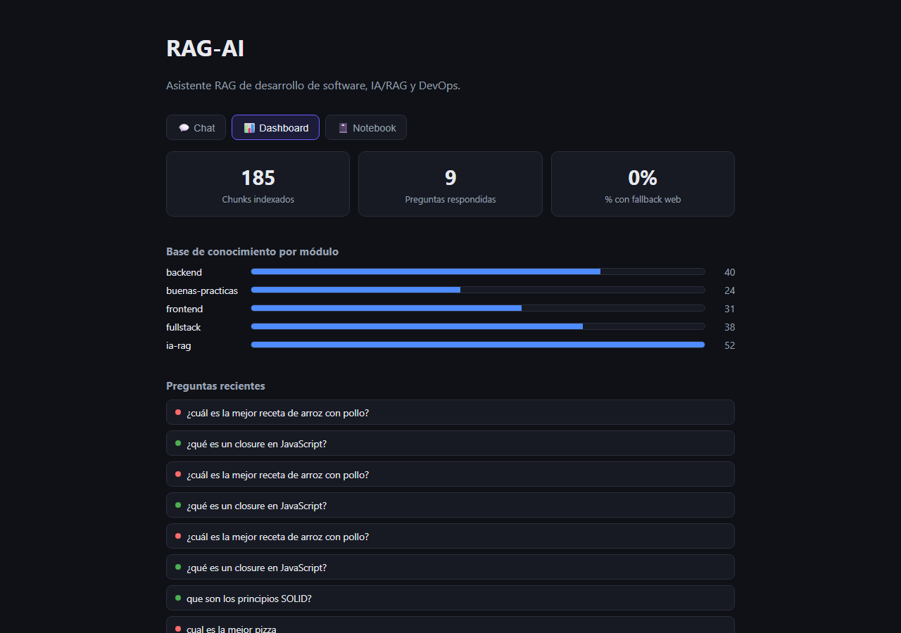
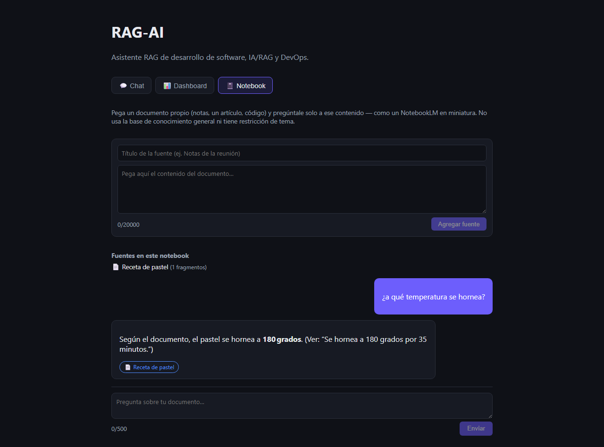

# RAG-AI — Asistente RAG de Desarrollo de Software

**[🔗 Demo en vivo](https://rag-groq-portfolio.onrender.com)** · Backend API:
`https://rag-groq-portfolio-api.onrender.com`

> ℹ️ El backend corre en el free tier de Render. Un workflow de GitHub Actions
> ([`keepalive.yml`](.github/workflows/keepalive.yml)) hace ping a `/health` cada 10 minutos
> para evitar que el servicio se duerma (Render lo suspende tras 15 min sin tráfico), así que
> la demo normalmente responde rápido. Si el workflow lleva un rato sin correr (por ejemplo,
> justo después de un redeploy), el primer mensaje puede tardar ~30-50s en "despertar" el
> servicio — los siguientes son rápidos.

## Qué hace el proyecto

Chatbot RAG (Retrieval-Augmented Generation) especializado **exclusivamente** en desarrollo
de software full-stack, IA/RAG y DevOps (frontend, backend, bases de datos, testing,
arquitectura, CI/CD, embeddings, LLMs, agentes de código, buenas prácticas). No es un chat
genérico: tiene una base de conocimiento propia de ~185 fragmentos indexados por embeddings,
guardrails que lo mantienen dentro de su dominio, y un fallback de búsqueda web para preguntas
recientes que su base de conocimiento no cubre — siempre citando de dónde salió cada parte de
la respuesta. Tiene tres pestañas:

- **💬 Chat** — el asistente de desarrollo de software descrito arriba.
- **📊 Dashboard** — métricas en vivo de la base de conocimiento y del uso real del chat
  (chunks por módulo, preguntas respondidas, % que usó fallback web, feed de preguntas
  recientes).
- **📓 Notebook** — modo estilo *NotebookLM*: pegás un documento propio (notas, un artículo,
  lo que sea) y le preguntás solo a ese contenido, en una sesión aislada por navegador y sin
  la restricción de tema del chat principal.

## Capturas

| Chat vacío | Respuesta con fuentes citadas (KB) | Guardrail de alcance |
|---|---|---|
|  |  |  |

| Dashboard con métricas en vivo | Notebook: documento propio + pregunta |
|---|---|
|  |  |

Capturadas con Playwright contra la demo en vivo (ver
[`scripts/capture_screenshots.md`](scripts/capture_screenshots.md) para reproducirlas).

## Tecnologías

| Componente | Elección |
|---|---|
| Frontend | React + Vite + TypeScript, desplegado como Static Site en Render |
| Backend | Python + FastAPI, desplegado como Web Service en Render |
| Vector DB | Supabase (Postgres) + extensión **pgvector**, índice HNSW |
| Embeddings | `sentence-transformers/all-MiniLM-L6-v2` vía **fastembed** (ONNX Runtime, local, gratis, 384 dims, ~190MB de RAM en vez de los 450MB+ de PyTorch) |
| LLM | **Groq API** — `openai/gpt-oss-120b` (respuesta) y `openai/gpt-oss-20b` (check de alcance) |
| Búsqueda web (fallback) | `duckduckgo-search`, sin API key |
| CI | GitHub Actions (pytest + npm test/build, separados por paths) |
| Testing | pytest + pytest-mock (backend), Vitest + Testing Library (frontend) |

## Arquitectura

Ver [`docs/architecture.md`](docs/architecture.md) para el diagrama completo y el flujo
detallado de una consulta (guardrails → retrieval → fallback web → generación).

## Instalación y uso local

**Backend:**
```bash
cd backend
python -m venv .venv
.venv\Scripts\activate          # Windows; en Linux/Mac: source .venv/bin/activate
pip install -r requirements-dev.txt
cp .env.example .env            # completar GROQ_API_KEY, SUPABASE_URL, SUPABASE_SERVICE_ROLE_KEY
uvicorn app.main:app --reload
```

**Frontend:**
```bash
cd frontend
npm install
cp .env.example .env
npm run dev
```

**Cargar la base de conocimiento** (desde `backend/`, con el venv activado):
```bash
python -m scripts.ingest
```

**Tests:**
```bash
cd backend && pytest tests -v
cd frontend && npm run test
```

Más detalles de convenciones, estructura y cómo agregar documentos al corpus en
[`AGENTS.md`](AGENTS.md).

## Problemas que resolvió

- **El backend se caía (502) al primer request pesado por falta de memoria**: en Render free
  tier (512MB de RAM), cargar `sentence-transformers` + PyTorch para generar el primer
  embedding hacía que el proceso subiera de ~20MB a 440-450MB de RSS y lo mataba el OOM killer
  justo al límite — confirmado con las métricas de memoria de Render, que mostraban el patrón
  clásico de sierra (memoria subiendo hasta el tope, caída abrupta por el kill, y vuelta a
  subir en el reinicio). Se resolvió reemplazando `sentence-transformers`/PyTorch por
  **fastembed** (el mismo modelo `all-MiniLM-L6-v2`, corrido vía ONNX Runtime en vez de
  PyTorch): el mismo embedding ahora usa ~190MB de RAM, dejando margen holgado dentro del
  límite del free tier. Se re-ingestó todo el corpus con el nuevo backend para mantener
  consistencia entre los embeddings de la KB y los de cada consulta.
- **El catálogo de modelos de un proveedor de LLM cambia sin aviso**: los modelos
  planeados originalmente (`llama-3.3-70b-versatile`, `llama-3.1-8b-instant`) ya no existían
  en Groq al momento de probar contra la API real — el proveedor había migrado su catálogo a
  la familia `openai/gpt-oss-*`. Se resolvió listando los modelos disponibles vía la API en
  vez de asumir nombres fijos, y documentando el hallazgo en el propio corpus del proyecto.
- **Modelos "razonadores" con `max_tokens` insuficiente devuelven respuesta vacía**: los
  modelos `gpt-oss` gastan tokens de salida en razonamiento interno antes de la respuesta
  final; con un `max_tokens` pequeño (pensado para un modelo no razonador), el check de
  alcance devolvía `""` con `finish_reason="length"` en vez de "SI"/"NO". Se resolvió
  aumentando el presupuesto de tokens para ese check.
- **Overlap de chunking compuesto recursivamente**: la primera versión del splitter de texto
  aplicaba el overlap en cada nivel de recursión del algoritmo, haciendo que algunos chunks
  crecieran muy por encima del tamaño máximo configurado. Se resolvió separando el split puro
  (sin overlap) de la aplicación del overlap, que ahora ocurre una sola vez por sección.
- **Nuevas API keys de Supabase incompatibles con el cliente Python**: `supabase-py` en una
  versión desactualizada validaba las keys con una regex estricta de JWT y rechazaba el nuevo
  formato `sb_secret_.../sb_publishable_...` con "Invalid API key". Se resolvió actualizando
  la librería.
- **Build de Render lento/pesado por CUDA innecesario**: el wheel default de PyTorch en PyPI
  instala ~2GB de paquetes NVIDIA/CUDA aunque el free tier de Render no tiene GPU. Primero se
  resolvió fijando el build CPU-only de PyTorch, y finalmente quedó resuelto del todo al
  eliminar PyTorch por completo (ver el problema de memoria arriba).
- **Prompt injection vía contenido recuperado**: un documento (o resultado web) podría
  contener texto que intente instruir al modelo directamente. Se mitigó envolviendo todo el
  contexto recuperado en tags `<contexto_kb>`/`<contexto_web>` con una instrucción explícita
  en el system prompt de tratarlo siempre como datos citados, nunca como órdenes — verificado
  con un test que simula un chunk con una instrucción de "ignora las reglas anteriores".

## Qué aprendí

Diseñar un pipeline RAG completo de punta a punta (chunking con overlap real, embeddings
locales, similarity search en pgvector, construcción de prompts con guardrails explícitos),
la importancia de no asumir que la documentación de un proveedor de LLM sigue vigente y
validar contra la API real, cómo los modelos de razonamiento cambian el contrato de
`max_tokens`, y cómo diseñar un pipeline de despliegue gratuito (Supabase + Groq + Render)
completo para un proyecto de portafolio sin incurrir en costos.

## Licencia

MIT — ver [`LICENSE`](LICENSE).
